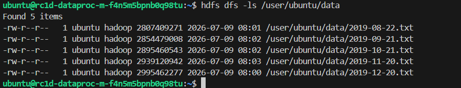

# Настройка облачной инфраструктуры для проекта по определению мошеннических транзакций

[ссылка на задание](https://github.com/OtusTeam/MLOps/tree/main/hw_02)

## Материалы для проверки 

**Данные в object storage:** 
ссылка на s3: s3://hw-2-bucket 

**Содержимое Data-подкластера:** 

